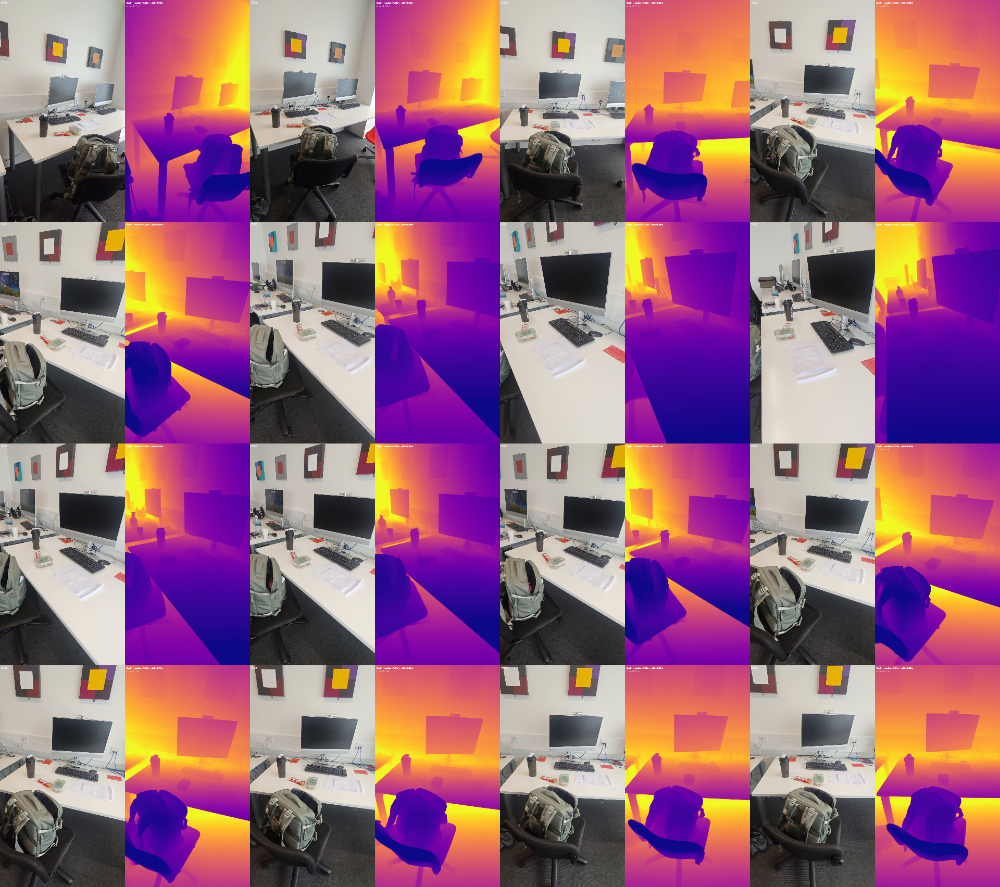
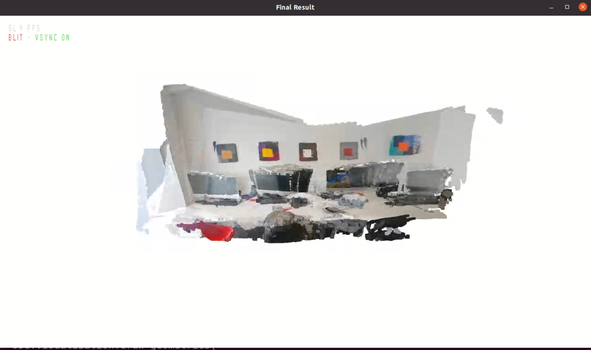
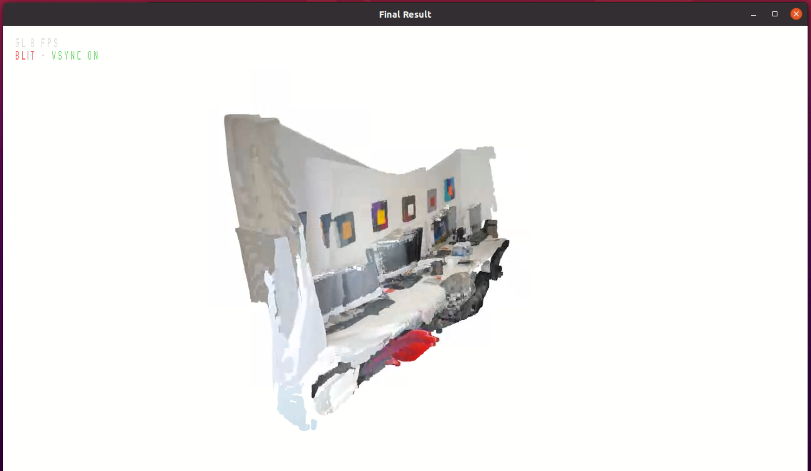
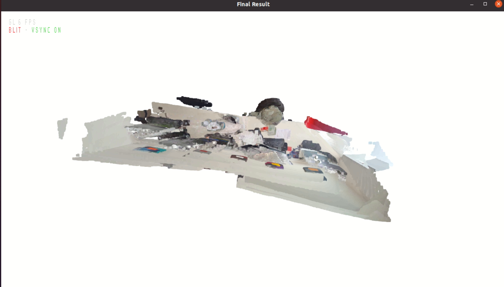

# Video to 3D Scene Reconstruction

> **From a 30-second phone video to a coloured 3D point cloud** — using classical SfM, a metric depth foundation model, and robust scale alignment. No depth sensor, no stereo rig, no calibration target.

---

## Example Output

### Input → Depth → 3D Reconstruction




### 3D Point Cloud — Final Result

| Front view | Side view | Top view |
|:----------:|:---------:|:--------:|
|  |  |  |

*Reconstructed from a 30-second phone video. Wall, art panels, desk surface and objects all visible. Coloured point cloud viewable in MeshLab / CloudCompare / Open3D.*

---

## Pipeline

```
phone video  (~30s mp4)
      │
      ▼  1. extract_frames.py
      │     Uniform temporal sampling + blur filtering → ~100–200 keyframes
      │
      ▼  2. estimate_poses.py
      │     COLMAP sequential SfM → K, [R|t] per frame, sparse 3D points
      │
      ▼  3. estimate_depth.py
      │     Apple Depth Pro → metric depth maps (float32, metres)
      │
      ▼  4. fuse_pointcloud.py
             Robust scale alignment + back-projection + outlier removal
             → outputs/pointcloud_aligned.ply
```

---

## Quickstart

```bash
# 1. Environment
conda create -n video3d python=3.10 -y && conda activate video3d
pip install torch torchvision --index-url https://download.pytorch.org/whl/cu118
pip install open3d==0.18.0 opencv-python "numpy<2.0" matplotlib Pillow scipy
sudo apt install colmap

# 2. Depth Pro
git clone https://github.com/apple/ml-depth-pro.git
cd ml-depth-pro && pip install -e . && source get_pretrained_models.sh && cd ..
ln -s ~/ml-depth-pro/checkpoints checkpoints

# 3. Run
python run_pipeline.py --video your_video.mp4 --output_dir outputs/

# 4. View
python -c "import open3d as o3d; pcd = o3d.io.read_point_cloud('outputs/pointcloud_aligned.ply'); o3d.visualization.draw_geometries([pcd])"
```

---

## Visualisation outputs

Each stage writes to `outputs/viz/`:

| File | What to check |
|------|--------------|
| `keyframes_contact_sheet.png` | Frame quality and coverage |
| `flow_scores.png` | Motion distribution across video |
| `sparse_reconstruction.png` | Camera trajectory (COLMAP) |
| `depth_overview.png` | RGB ↔ depth comparison |
| `depth_statistics.png` | Per-frame depth consistency |

---

## Design choices

### Why Depth Pro?

Depth Pro outputs **metric depth** (real-world metres) from a single uncalibrated image — turning any phone video into a virtual RGB-D stream. Standard monocular models (MiDaS, DPT) output only relative depth, which cannot be directly fused across frames without scale estimation. Metric depth eliminates this problem at the source.

### The scale alignment problem — and how we solve it

COLMAP reconstructs geometry in an arbitrary coordinate system; its unit is not metres. Combining COLMAP poses with Depth Pro metric depths naively produces shattered reconstructions.

We solve this with a **robust median scale estimator** using COLMAP's sparse 3D points as ground truth:

```python
# For each sparse 3D point visible in a frame:
z_colmap    = (R @ point_world + t)[2]        # depth in COLMAP units
z_depthpro  = depth_map[v_pixel, u_pixel]     # depth in metres

scale = median(z_depthpro / z_colmap)         # over all frames and points
```

On our desk scene: **616,322 correspondences**, `scale = 0.1808 ± 0.041`  
Cross-check: camera bbox X = 10.38 × 0.181 = **1.88 m** (desk is ~1.8 m wide ✓)

This is more principled than heuristic trajectory-length estimates and is the key contribution of our fusion step.

### Why direct back-projection instead of TSDF?

We tested TSDF volumetric fusion (Open3D `ScalableTSDFVolume`). In practice it proved brittle for monocular depth: the extrinsic convention in the API is ambiguous, and small errors cause catastrophic drift. Direct back-projection is simpler, more interpretable, and easier to debug:

```python
x_cam = (u - cx) / fx * depth_metres
y_cam = (v - cy) / fy * depth_metres
p_world = C2W_metric @ [x_cam, y_cam, depth_metres, 1]
```

The tradeoff: TSDF would average out per-frame noise via weighted integration. We compensate with voxel downsampling and statistical outlier removal. The final output is `outputs/pointcloud_aligned.ply` — a coloured point cloud viewable in MeshLab, CloudCompare, or Open3D.

### Hardware constraint: no Gaussian Splatting or NeRF

3D Gaussian Splatting and Instant-NGP require `sm_70+` CUDA kernels and cannot compile on our GTX Titan X (`sm_52`). This pipeline is deliberately designed around this constraint — no custom CUDA, no compilation step, runs on any CUDA-capable GPU.

### Limitations

- **~180° coverage**: the input video covers one side of the desk. Unobserved surfaces are not reconstructed — this is fundamental to passive monocular reconstruction, not a system failure.
- **Dark surfaces**: Depth Pro is less stable on dark, low-texture objects. Statistical filtering removes most artefacts.
- **Inference time**: ~6 s/frame on GTX Titan X for Depth Pro.

---

## Hardware tested

| | |
|-|-|
| GPU | 2× GTX Titan X (12 GB, sm_52) |
| CUDA | 12.8 / PyTorch 2.4.1+cu118 |
| OS | Ubuntu 20.04 |

---

## Structure

```
video-to-3d/
├── run_pipeline.py
├── scripts/
│   ├── extract_frames.py
│   ├── estimate_poses.py
│   ├── estimate_depth.py
│   └── fuse_pointcloud.py
├── requirements.txt
└── assets/screenshots/
```

---

## Credits

- [Apple ml-depth-pro](https://github.com/apple/ml-depth-pro) — metric monocular depth
- [COLMAP](https://colmap.github.io/) — Structure-from-Motion
- [Open3D](http://www.open3d.org/) — 3D processing and visualisation

---

## Comparison: VGGT (Meta CVPR 2025)

We evaluated [VGGT](https://github.com/facebookresearch/vggt) as a feed-forward alternative that predicts camera poses and 3D geometry directly from images without COLMAP or explicit depth estimation.
**Result on our hardware**: VGGT requires `bfloat16` which is unsupported on Maxwell GPUs (sm_52 / GTX Titan X). Falling back to `float32` produces severely degraded results due to numerical precision issues in the attention layers.
**Takeaway**: VGGT is a promising direction but currently requires Volta+ GPUs (sm_70+). Our COLMAP + Depth Pro pipeline was specifically designed to run on sm_52 hardware — this is a deliberate engineering constraint, not a limitation of the approach.

| | Our pipeline | VGGT |
|--|--|--|
| GPU requirement | sm_52+ (any CUDA GPU) | sm_70+ (Volta+) |
| bfloat16 required | No | Yes |
| Scale alignment | Explicit (robust median) | Implicit (learned) |
| Result on Titan X | ✅ Good | ❌ Fails |
